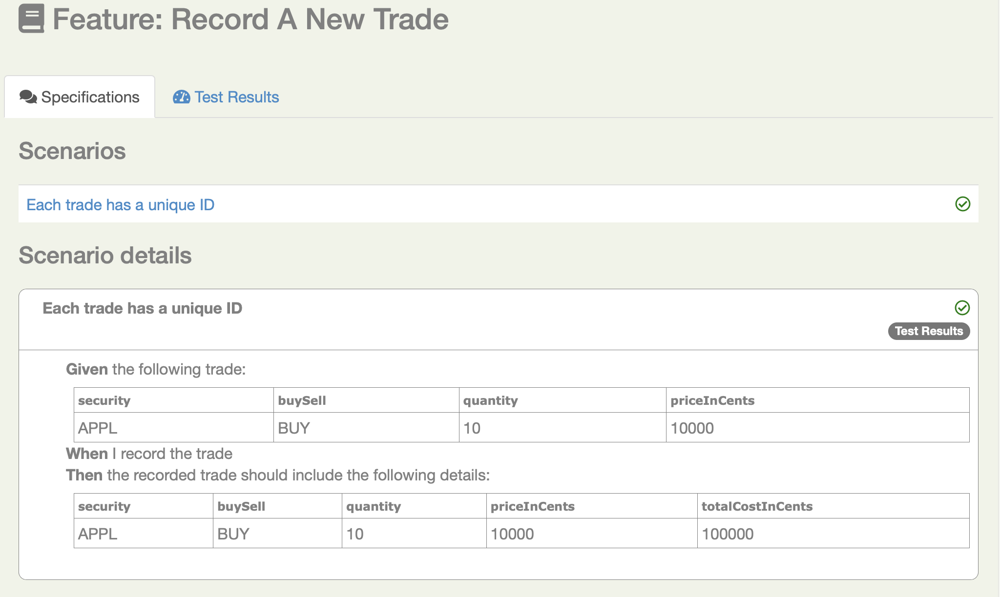

# Getting started with REST API testing with Serenity and Cucumber 4

This tutorial show you how to get started with REST-API testing using Serenity and Cucumber 4. 


## The starter project
The best place to start with Serenity and Cucumber is to clone or download the starter project on Github ([https://github.com/serenity-bdd/serenity-rest-starter](https://github.com/serenity-bdd/rest-cucumber4-starter)). 
This project gives you a basic project setup, along with some sample tests and supporting classes. 
The starter project comes bundled with a sample SpringBoot web service, and some RestAssured-based tests. 
The project also illustrates how you might use Freemarker to prepare test data for your scenarios.

### The project directory structure
The project has build scripts for both Maven and Gradle, and follows the standard directory structure used in most Serenity projects:
```Gherkin
src
  + main
  + test
    + java                                Test runners and supporting code
    + resources
      + features                          Feature files


          + status
          + trades
             record_a_new_trade.feature 
      + templates                         Freemarker templates and properties files                

```

### Adding the Cucumber 4 dependency
Serenity seamlessly supports both Cucumber 2.x and Cucumber 4. 
However, this flexibility requires a little tweaking in the build dependencies.

If you are using Maven, you need to do the following:
- exclude the default `cucumber-core` dependency from your `serenity-core` dependency
- Replace your `serenity-cucumber` dependency with the `serenity-cucumber4` dependency
- Add dependencies on the Cucumber 4.x version of `cucumber-java` and `cucumber-junit` into your project

An example of the correctly configured dependencies is shown below:
```xml
<dependency>
    <groupId>net.serenity-bdd</groupId>
    <artifactId>serenity-core</artifactId>
    <version>2.0.38</version>
    <scope>test</scope>
    <exclusions>
        <exclusion>
            <groupId>io.cucumber</groupId>
            <artifactId>cucumber-core</artifactId>
        </exclusion>
    </exclusions>
</dependency>
<dependency>
    <groupId>net.serenity-bdd</groupId>
    <artifactId>serenity-cucumber4</artifactId>
    <version>1.0.4</version>
    <scope>test</scope>
</dependency>
<dependency>
    <groupId>io.cucumber</groupId>
    <artifactId>cucumber-java</artifactId>
    <version>4.2.0</version>
</dependency>
<dependency>
    <groupId>io.cucumber</groupId>
    <artifactId>cucumber-junit</artifactId>
    <version>4.2.0</version>
</dependency>
```

If you are using Gradle, you need to ensure that the 4.x version of `cucumber-core` is used using the _resolutionStrategy_ element, and also add the Cucumber 4.x version of `cucumber-java` and `cucumber-junit` dependencies as mentioned above:
```Gradle
configurations.all {
    resolutionStrategy {
        force "io.cucumber:cucumber-core:4.2.0"
    }
}

dependencies {
    testCompile "net.serenity-bdd:serenity-core:2.0.38",
                "net.serenity-bdd:serenity-cucumber4:1.0.4",
                "io.cucumber:cucumber-core:4.2.0",
                "io.cucumber:cucumber-junit:4.2.0"
}
```


## Living documentation

You can generate full Serenity reports by running `mvn clean verify`. 
This includes both the living documentation from the feature files:



And also details of the REST requests and responses that were executed during the test:


## Want to learn more?
For more information about Serenity BDD, you can read the [**Serenity BDD Book**](https://serenity-bdd.github.io/theserenitybook/latest/index.html), the official online Serenity documentation source. Other sources include:
* **[Byte-sized Serenity BDD](https://www.youtube.com/channel/UCav6-dPEUiLbnu-rgpy7_bw/featured)** - tips and tricks about Serenity BDD
* [**Serenity BDD Blog**](https://johnfergusonsmart.com/category/serenity-bdd/) - regular articles about Serenity BDD
* [**The Serenity BDD Dojo**](https://serenitydojo.teachable.com) - Online training on Serenity BDD and on test automation and BDD in general.
